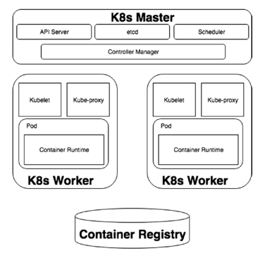
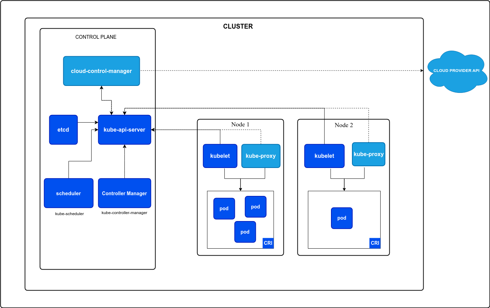

# K8S Architecture/Components

Kubernetes follows a client-server architecture where the master is installed on a <machine> and <nodes> are distributed across multiple machines accessible via the master. 

Kubernetes consists of two main architectural components: the control plane and the data plane. 

> The control plane manages the worker nodes (data plane) and ensures the cluster runs smoothly.

## Control Plane:

- API Server (kube-apiserver): The central component that acts as the main point of access for Kubernetes. It exposes a RESTful API for interacting with the cluster and manages all cluster resources (e.g., deployments, pods, services).
- Etcd: A highly available key-value store that stores the shared state of the Kubernetes cluster. It holds the desired state of all Kubernetes objects configured by users.
- Scheduler (kube-scheduler): Responsible for scheduling pods (containers) on worker nodes based on resource availability, pod requirements, and scheduling policies.
- Controller Manager (kube-controller-manager): Runs a set of controllers that continuously monitor the cluster's state and ensure it matches the desired state defined in the API server. These controllers manage various aspects like pod lifecycle, service endpoints, replica sets, and more.
- Cloud Controller Manager (Optional): Manages interaction with cloud providers for resources like load balancers, volumes, and network policies (if running on a cloud platform).

- Nodes
- Communication between Nodes and the Control Plane
- Controllers
- Leases
- Cloud Controller Manager
- About cgroup v2
- Container Runtime Interface (CRI)
- Garbage Collection
- Mixed Version Proxy
