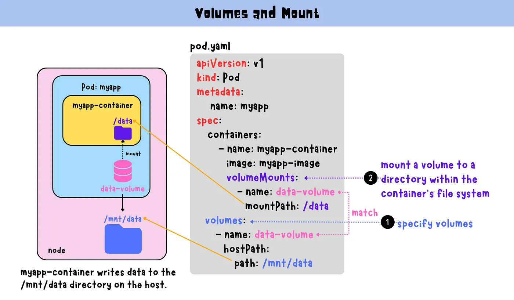
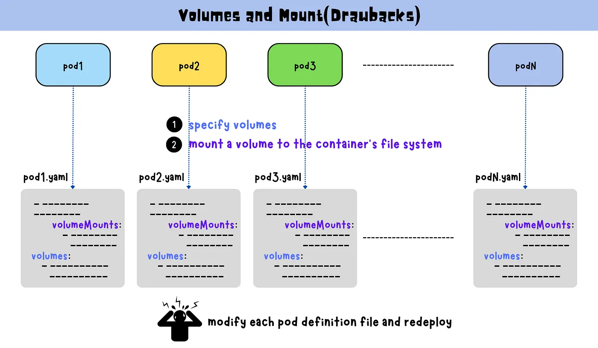

# Volumes and Mount

A volume is a directory that is accessible to containers in a pod. Volumes provide a way for containers to store and access data, and they can be used to share data between containers in the same pod.




```yaml
// pod.yaml
apiVersion: v1
kind: Pod
metadata:
  name: myapp
spec:
  containers:
    - name: myapp-container
      image: myapp-image
      volumeMounts:
        - name: data-volume
          mountPath: /data
  volumes:
    - name: data-volume
      hostPath:
        path: /mnt/data


```



> Note:
1. You must create a ConfigMap before you can use it.
2. A ConfigMap is always mounted as readOnly.
3. A container using a ConfigMap as a subPath volume mount will not receive ConfigMap updates.
4. Text data is exposed as files using the UTF-8 character encoding. For other character encodings, use binaryData.