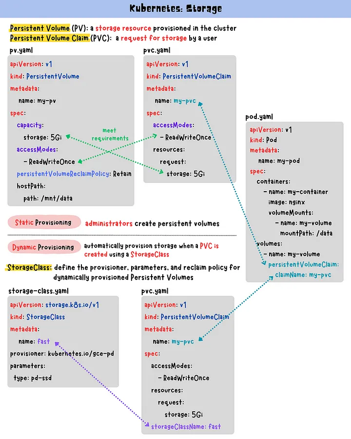

# Kubernetes storage basics:
Kubernetes storage is based on the concepts of volumes: there are ephemeral volumes that are often simply called volumes and there are Persistent Volumes that are meant for long-term storage.

In Kubernetes, pods are temporary and any data stored within them is lost when they’re deleted or restarted. To avoid this, use persistent storage options such as PVs(Persistent Volumes)and PVCs(Persistent Volume Claims). PVs are storage resources with an independent lifecycle, while PVCs are storage requests. Use them for simplified storage management and scaling. Provisioning persistent volumes can be static or dynamic. StorageClass defines the provisioner, parameters, and reclaim policy for dynamically provisioned PVs.